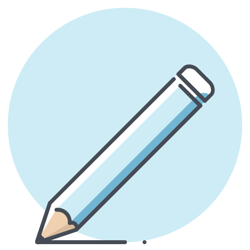
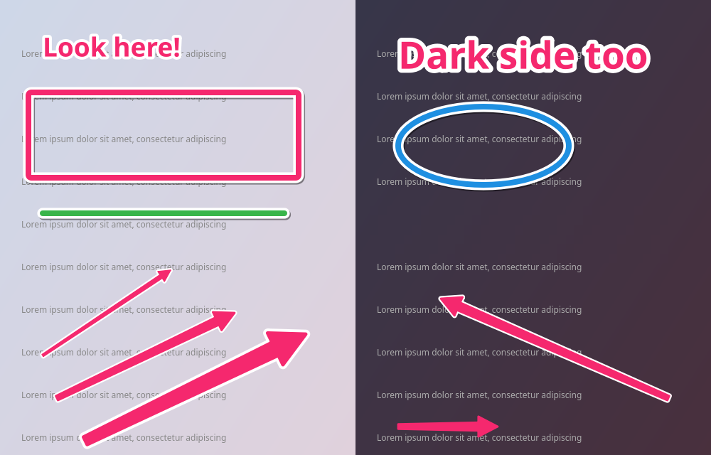
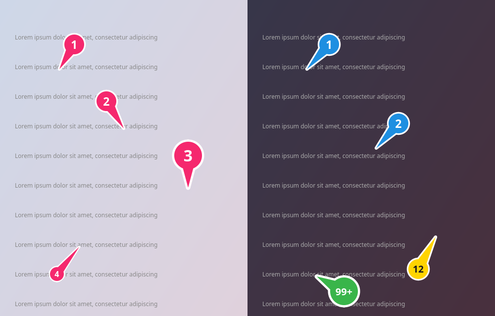
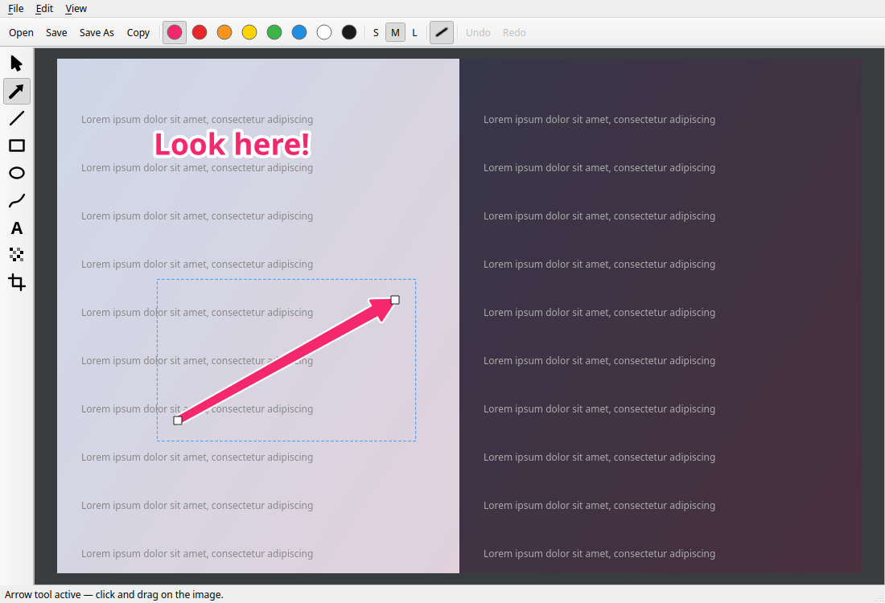

<div align="center">



# SkitchG

**Fast, minimal Skitch-inspired image annotation for Linux.**

Open an image → drag a big pink arrow → `Ctrl+C` → paste. Done.

[](https://github.com/cgillinger/SkitchG/actions/workflows/ci.yml)
[](https://www.python.org/)
[](https://doc.qt.io/qtforpython-6/)
[](#install)
[](LICENSE)
[](https://github.com/cgillinger/SkitchG/releases)



</div>

---

## Why SkitchG?

[Skitch](https://evernote.com/products/skitch) made visual communication
effortless: point at things with big, bold arrows instead of writing three
paragraphs. Evernote discontinued Skitch everywhere except macOS — leaving
Linux users without a true equivalent.

**SkitchG is a Skitch alternative for Linux** (Linux Mint, Ubuntu, Fedora,
and any desktop with Qt support). It is *not* a screenshot tool like
Flameshot or ksnip, and *not* an image editor like GIMP — it is a focused
**image annotation tool** for existing images, optimized for one flow:

```text
1. Open image   2. Drag arrow   3. Ctrl+C   4. Paste in chat / ticket / doc
```

No accounts. No cloud. No layers. No dialogs you didn't ask for.

## Features

- 🎯 **Skitch-style arrows** — thick tapered shaft, big filled head, white
  outline + drop shadow, readable on any background
- 📍 **Numbered markers** — Skitch-style pins with an auto-incrementing
  number in the head; drag to aim the pointer tail, double-click to relabel
- 🅰️ **Bold outlined text** — click, type, Enter. Done.
- ⬜ Rectangle, ellipse, line, freehand pen
- 🔒 **Pixelate** tool for hiding sensitive information (names, emails, keys)
- ✂️ Crop
- ↕️ Select, move and reshape annotations with drag handles
- ↩️ Full undo/redo for every action
- 📋 **Copy the rendered image straight to the clipboard** (`Ctrl+C`)
- 💾 Export as PNG or JPEG — saves as `name_annotated.png` by default; the
  **original file is never overwritten** without explicit confirmation
- 🖼️ Opens PNG, JPG/JPEG, WebP and BMP, respects EXIF rotation
- ⚡ Annotations stay vector-based while editing — rasterized only on export

<div align="center">


</div>

## Install

Requires Python 3.10+ on any Linux desktop.

```bash
git clone https://github.com/cgillinger/SkitchG.git
cd SkitchG
python3 -m venv .venv
.venv/bin/pip install -r requirements.txt
```

Run it:

```bash
./skitchg-launcher.sh image.jpg        # or: .venv/bin/python app.py image.jpg
```

### Desktop integration (optional)

```bash
./install-desktop.sh
```

Installs the `skitchg` command in `~/.local/bin`, adds SkitchG to the
application menu, and registers it for **right-click → Open With → SkitchG**
on image files.

## Keyboard shortcuts

| Key | Action | | Key | Action |
|---|---|---|---|---|
| `A` | **Arrow** | | `Ctrl+O` | Open image |
| `T` | Text | | `Ctrl+S` | Save (`name_annotated.png`) |
| `R` | Rectangle | | `Ctrl+Shift+S` | Save As |
| `E` | Ellipse | | `Ctrl+C` | Copy image to clipboard |
| `L` | Line | | `Ctrl+Z` | Undo |
| `P` | Pen | | `Ctrl+Shift+Z` / `Ctrl+Y` | Redo |
| `M` | Numbered marker | | `Delete` | Delete selected |
| `X` | Pixelate | | `Esc` | Cancel / deselect |
| `C` | Crop | | `Ctrl+scroll` | Zoom (`Ctrl+0` fit, `Ctrl+1` 100%) |
| `V` | Select / move | | | |

## Usage tips

**Arrows** — click where the tail starts, drag toward what you're pointing
at, release. Switch to Select (`V`) to move an arrow or drag its endpoint
handles to reshape it.

**Text** — click, type. `Enter` commits, `Shift+Enter` adds a line,
`Esc` cancels. Double-click existing text to edit.

**Numbered markers** — click to drop a pin (numbers count up automatically:
1, 2, 3…), or click and drag to aim the pointer tail at the exact spot.
Double-click a marker to change its label (up to 3 characters, e.g. `12`
or `A`). Great for step-by-step instructions.

**Colors & sizes** — swatches in the top bar (default: strong pink that
reads on almost anything). `S`/`M`/`L` set stroke thickness and text size.
The outline button toggles the white outline + shadow. With a selection,
these restyle it; otherwise they set the style for new annotations.

> **Clipboard note:** on Linux the clipboard is owned by the running app.
> Keep SkitchG open until you've pasted, or use a clipboard manager.

## Project layout

```text
app.py                  entry point
skitchg/
  main_window.py        menus, toolbars, open/save/copy
  canvas.py             QGraphicsView canvas + tool interaction
  items.py              vector annotation items (arrow, text, …)
  commands.py           undo/redo commands
  export.py             flatten image + annotations for save/copy
  icons.py              programmatically drawn icons
  palette.py            colors, stroke sizes, constants
tests/test_smoke.py     offscreen end-to-end smoke test (runs in CI)
```

## Non-goals

No cloud sync, no accounts, no OCR, no layers, no filters, no AI, no general
image editing. SkitchG is an annotation tool — that focus is the feature.

## Related projects

- [Skitch](https://evernote.com/products/skitch) — the original (macOS only)
- [Marianne](https://github.com/takecy/marianne) — Skitch-style annotator built with Tauri
- [Flameshot](https://flameshot.org/) / [ksnip](https://github.com/ksnip/ksnip) — screenshot-first tools with annotation

## License & credits

[MIT](LICENSE) © Christian Gillinger

App icon: <a href="https://www.flaticon.com/free-icons/stationary" title="stationary icons">Stationary icons created by Sergei Kokota - Flaticon</a>

<sub>Keywords: image annotation tool, Skitch alternative Linux, annotate
screenshots, arrow annotation, markup images, pixelate sensitive data,
PySide6, Qt6, Linux Mint, Ubuntu</sub>
